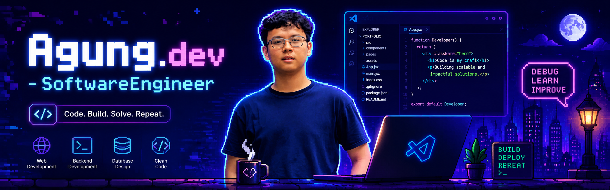

  

 

 

### 👾 About Me

I'm a Software Engineer based in **Jakarta, Indonesia**, focused on **Golang** for backend and **Vue.js and NextJS** for frontend — with a growing interest in AI-powered systems (GraphRAG search). I like building clean, scalable systems and I'm currently leveling up my skills in agentic AI dev workflows.

- 🧠 Exploring AI-assisted coding as part of my daily workflow
- 💬 Bahasa Indonesia (native) · English (working proficiency)
- 📍 Jakarta, Indonesia

 

### 🎯 Current Focus

My main focus right now is building **Rootcraft** — an AI-powered tool designed to automatically generate high-quality Product Requirements Documents (PRD). I'm currently exploring advanced AI integrations and agentic workflows to help product teams move from idea to execution faster and more efficiently.

 

### ⚔️ Tech Stack

<table>
  <tr>
    <td align="center" width="200">
      <b>Backend</b>  
      
    </td>
    <td align="center" width="250">
      <b>Frontend</b>  
      
    </td>
    <td align="center" width="200">
      <b>Database</b>  
      
    </td>
  </tr>
  <tr>
    <td align="center" width="200">
      <b >Tools</b>  
      
    </td>
    <td align="center" width="250">
      <b>OS</b>  
      
    </td>
    <td align="center" width="200">
      <b >Others</b>  
      
    </td>
  </tr>
</table>

> ~1 year of hands-on experience with Golang, Vue.js & Next.js, gained by shipping real production features during internships.

---

### 📜 Experience

**Software Engineer** @ PT Inovasi Data Cerdas
Built a company profile site + AI product, including a GraphRAG-based search feature.

**IT Developer Intern** @ PT Temas Tbk
Developed an internal WMS in Golang + Vue.js with a responsive frontend and RESTful API integration.

---

↑ animated contribution snake — auto-generates via the <a href="https://github.com/Platane/snk">snk GitHub Action</a>

---

### 📡 Open Comms

_A wild opportunity in Golang & Vue.js / NextJS appeared — I'm ready._

